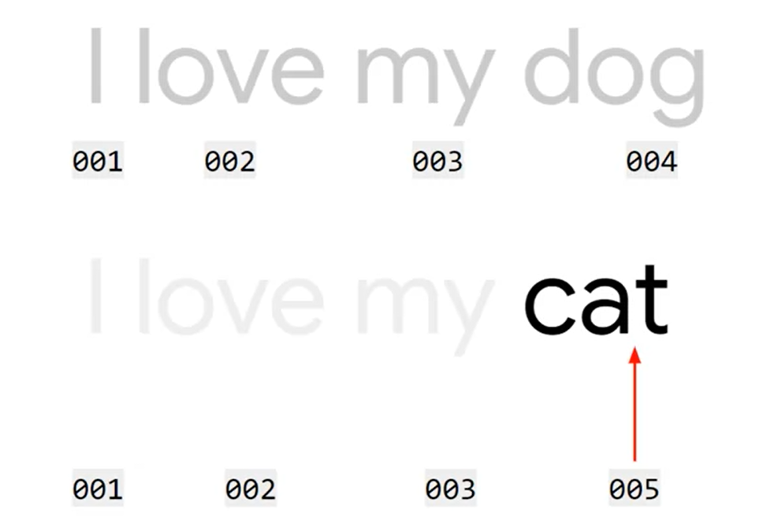
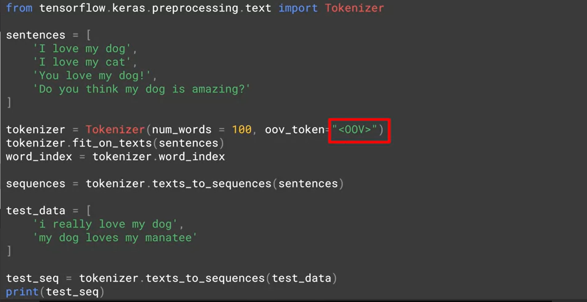
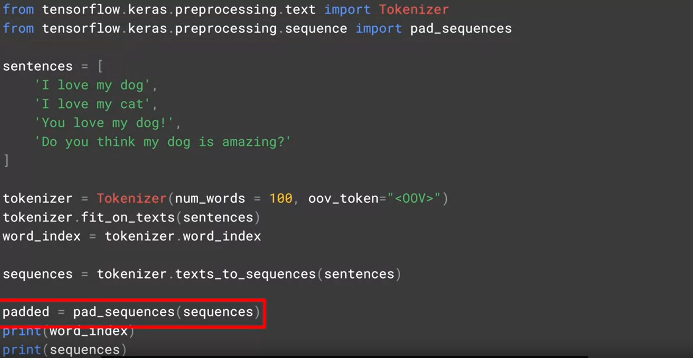
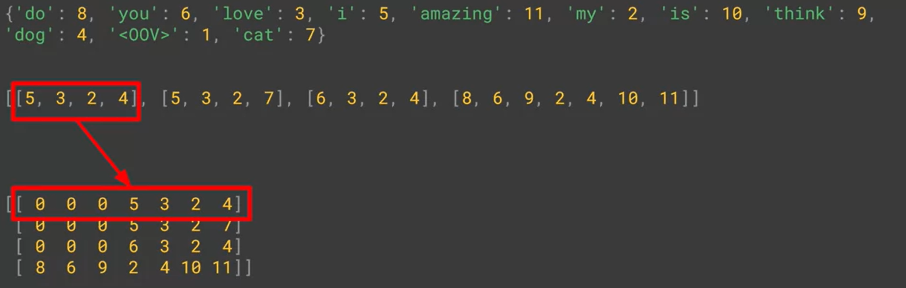
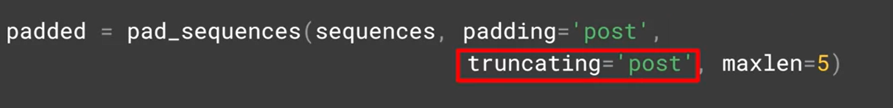
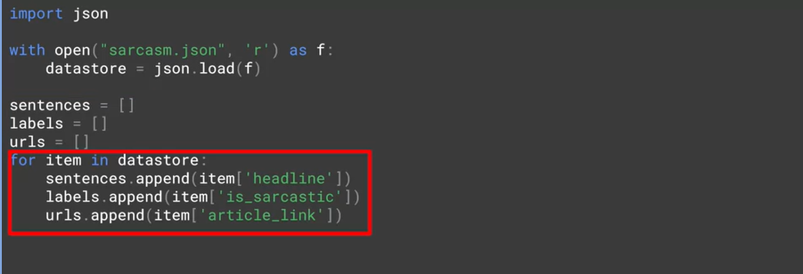

# natural-language-processing-tensorflow
Natural Language processing in tensorflow

## Word Encoding

## Same With ASCI CODE

With asci analysis the word **LISTEN** and *SILENT** are the same value but the two words are very differents of meaning.

## How Sentiment Analysis Work

* How we can observed the similarity between two words

* Now if we look at the two sentences to determine the difference between two sentences.

## How To Analyse The Synthaxe

## Creating The List Of Sequences

## Complete Analysis Corpus

## Padding Sequences

## Result Of Padding  Sequence 

## Personnalize Padding

## Sarcasm in News Headlines Dataset by Rishabh Misra

[https://rishabhmisra.github.io/publications/](https://rishabhmisra.github.io/publications/)

## How To Load Sarcasm Dataset

