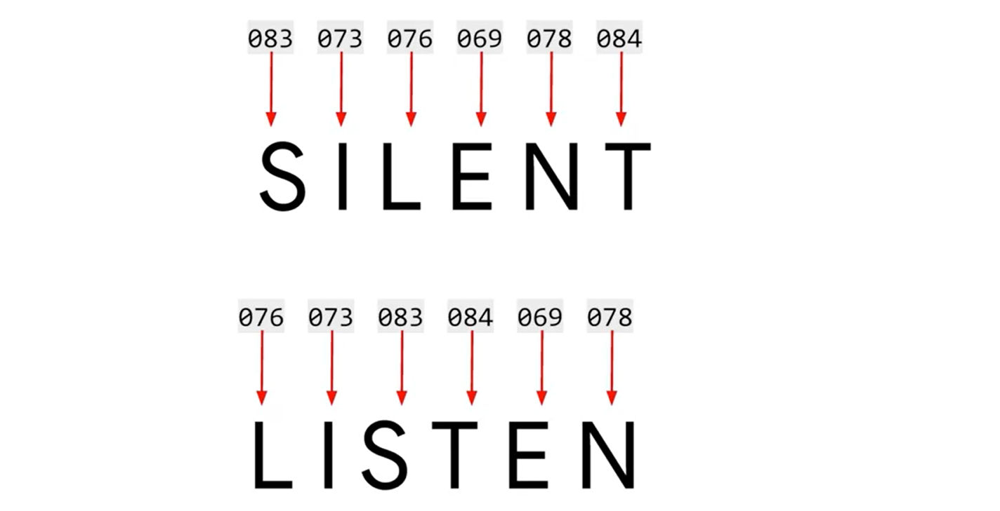
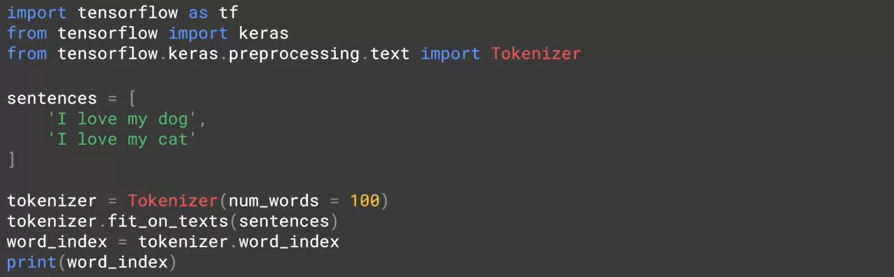

# natural-language-processing-tensorflow
Natural Language processing in tensorflow

## Word Encoding

## Same With ASCI CODE

With asci analysis the word **LISTEN** and *SILENT** are the same value but the two words are very differents of meaning.

## How To Analyse The Synthaxe

