# natural-language-processing-tensorflow
Natural Language processing in tensorflow

## Word Encoding

## Same With ASCI CODE

With asci analysis the word **LISTEN** and *SILENT** are the same value but the two words are very differents of meaning.

## How Sentiment Analysis Work

* How we can observed the similarity between two words

* Now if we look at the two sentences to determine the difference between two sentences.

## How To Analyse The Synthaxe

## Creating The List Of Sequences

## Complete Analysis Corpus

## Padding Sequences

## Result Of Padding  Sequence 

## Personnalize Padding

## Sarcasm in News Headlines Dataset by Rishabh Misra

[https://rishabhmisra.github.io/publications/](https://rishabhmisra.github.io/publications/)

## How To Load Sarcasm Dataset

## How To Analysis Sarcasm Dataset

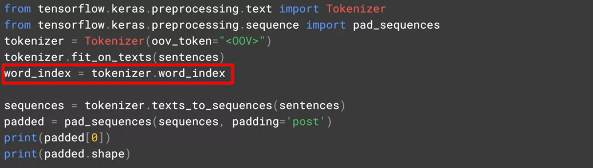

## Sarcasm Detection

* [https://www.kaggle.com/datasets/rmisra/news-headlines-dataset-for-sarcasm-detection](https://www.kaggle.com/datasets/rmisra/news-headlines-dataset-for-sarcasm-detection)

## Build-in Dataset In Tensorflow

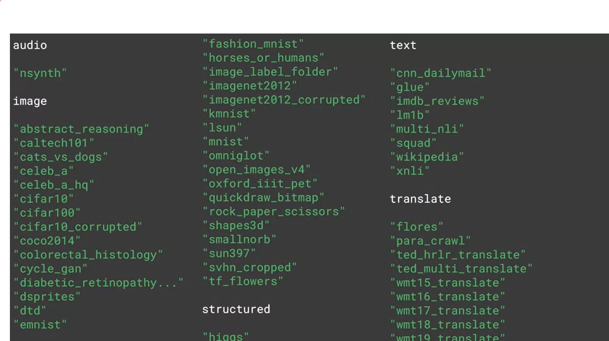

## Dataset

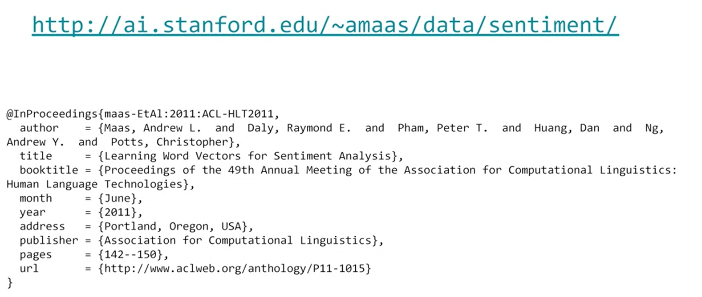

## Verify Tensorflow Version
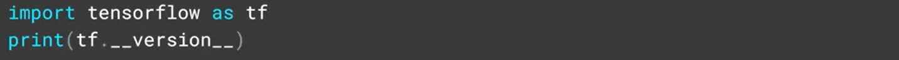

## Import Tensorflow Dataset

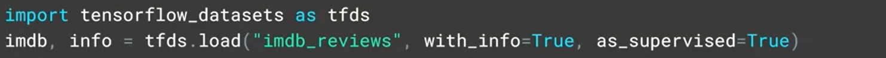

## Split data

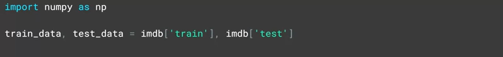

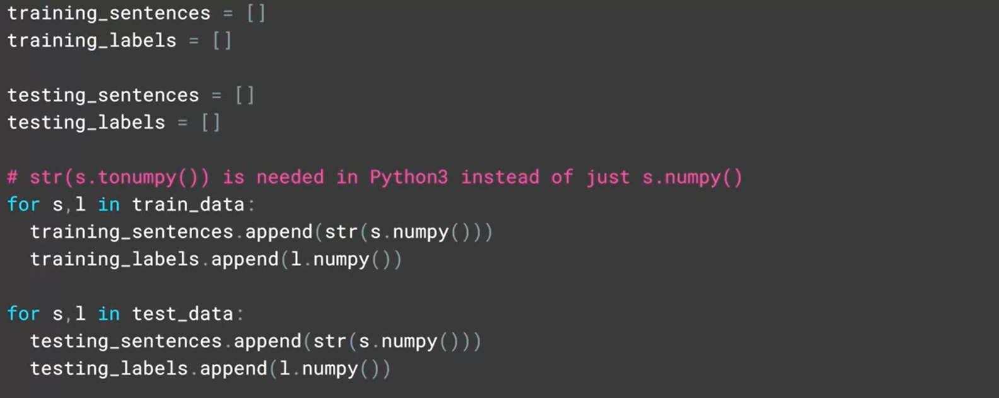

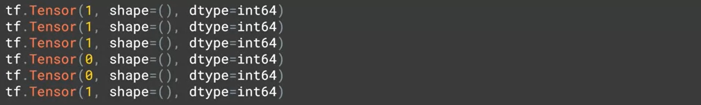

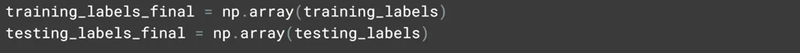

## Tokenizer

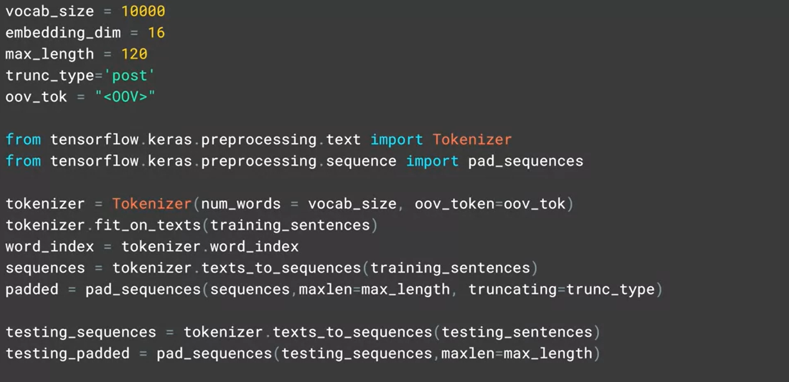

## Model

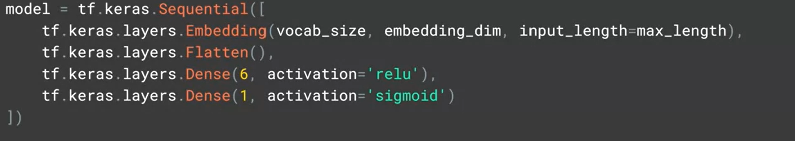

OR

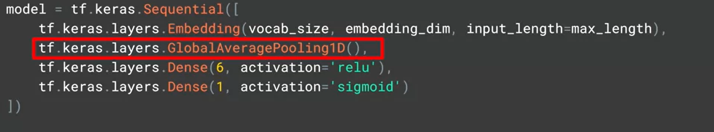

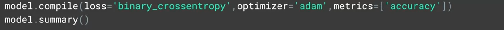

## Training Model

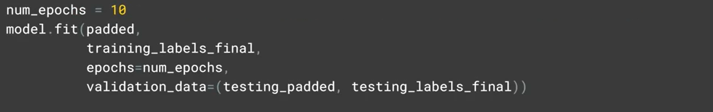

## Expect Layer

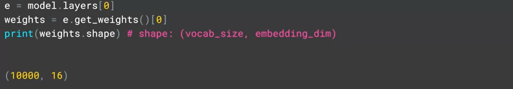

## Reverse Word Index

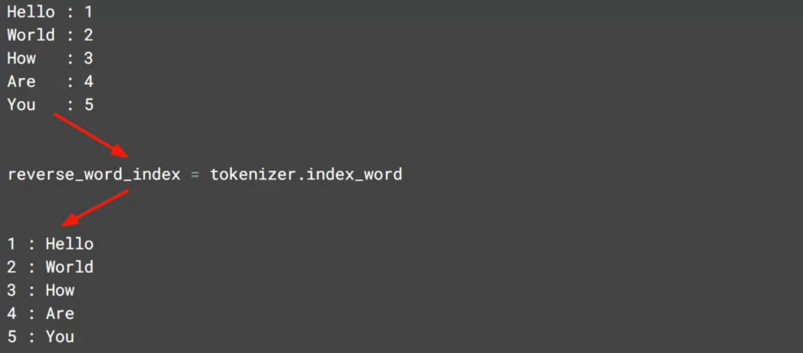

## Vecteor In Embedded Data

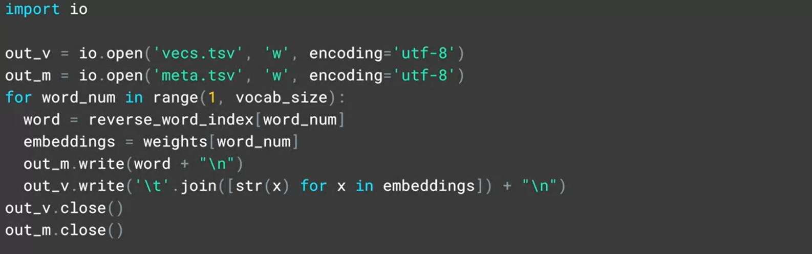

## Download In Colab

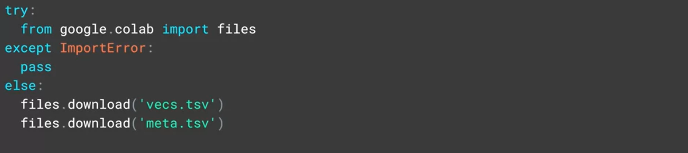

## Model For Sarcasm Dataset

### Importation of Tokenizer And Pad_sequence

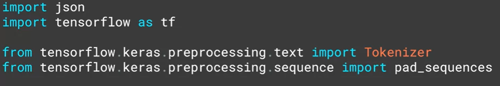

### Hyper Parameters

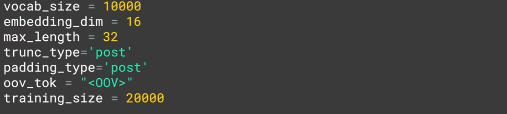

### Download Sarcasm Dataset

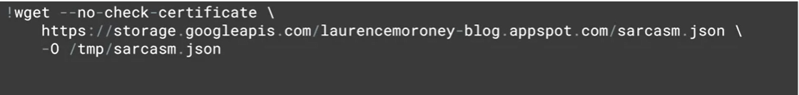

### Loading Sarcasm Dataset

![image]

## Userful Link

* [https://www.tensorflow.org/api_docs/python/tf/keras/preprocessing/text/Tokenizer](https://www.tensorflow.org/api_docs/python/tf/keras/preprocessing/text/Tokenizer)
  
* [https://ai.stanford.edu/~amaas/data/sentiment/](https://ai.stanford.edu/~amaas/data/sentiment/)