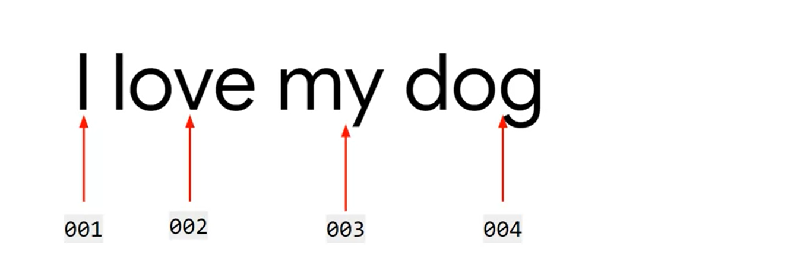
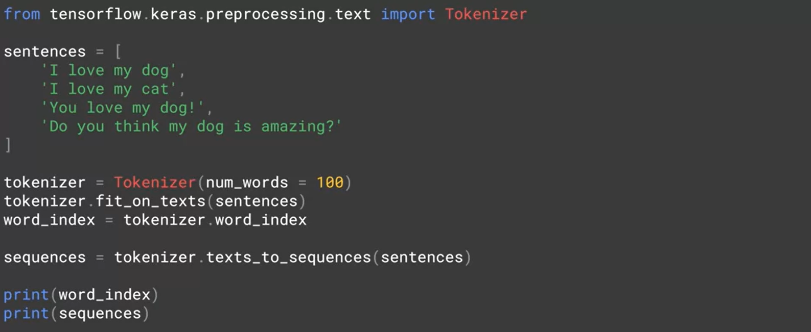

# natural-language-processing-tensorflow
Natural Language processing in tensorflow

## Word Encoding

## Same With ASCI CODE

With asci analysis the word **LISTEN** and *SILENT** are the same value but the two words are very differents of meaning.

## How Sentiment Analysis Work

* How we can observed the similarity between two words

* Now if we look at the two sentences to determine the difference between two sentences.

## How To Analyse The Synthaxe

## Creating The List Of Sequences

## Complete Analysis Corpus

## Padding Sequences

## Result Of Padding  Sequence 

## Personnalize Padding

## Sarcasm in News Headlines Dataset by Rishabh Misra

[https://rishabhmisra.github.io/publications/](https://rishabhmisra.github.io/publications/)

## How To Load Sarcasm Dataset

## How To Analysis Sarcasm Dataset

## Sarcasm Detection

* [https://www.kaggle.com/datasets/rmisra/news-headlines-dataset-for-sarcasm-detection](https://www.kaggle.com/datasets/rmisra/news-headlines-dataset-for-sarcasm-detection)

## Build-in Dataset In Tensorflow

## Dataset

## Verify Tensorflow Version

## Import Tensorflow Dataset

## Split data

## Tokenizer

## Model

OR

## Training Model

## Expect Layer

## Reverse Word Index

## Vecteor In Embedded Data

## Download In Colab

## Model For Sarcasm Dataset

### Importation of Tokenizer And Pad_sequence

### Hyper Parameters

### Download Sarcasm Dataset

### Loading Sarcasm Dataset

### Building a classifier for the sarcasm dataset

### Sequence Dataset

### Create A Model

### Summarization Of Model

### Training The Model

### Plotting The Result Of Training

## TensorFlow datasets

* [https://github.com/tensorflow/datasets/tree/master/docs/catalog](https://github.com/tensorflow/datasets/tree/master/docs/catalog)

* [https://www.tensorflow.org/datasets/catalog/overview](https://www.tensorflow.org/datasets/catalog/overview)

## Subwords text encoder

* [https://www.tensorflow.org/datasets/api_docs/python/tfds/deprecated/text/SubwordTextEncoder](https://www.tensorflow.org/datasets/api_docs/python/tfds/deprecated/text/SubwordTextEncoder)

## Diving into the code: Encode And Decode

## Classify Sub Word

## RNN

The neural Network is kind a function that we can a data and label it give a rules

## How RNN Work

## Visualize A Sequence

## More About RNN

* [https://www.coursera.org/lecture/nlp-sequence-models/deep-rnns-ehs0S](https://www.coursera.org/lecture/nlp-sequence-models/deep-rnns-ehs0S)

## How To Understang The Context Of Word

## Uni Directional Cell State

## Bi Directional Cell State

## How To Implement LSTM in Tensorflow

## How To Stack LSTM

## More About LSTMs

* [https://www.coursera.org/lecture/nlp-sequence-models/long-short-term-memory-lstm-KXoay](https://www.coursera.org/lecture/nlp-sequence-models/long-short-term-memory-lstm-KXoay)

## Generation A New Text Process

### Preparing the training data

## Userful Link

* [https://www.tensorflow.org/api_docs/python/tf/keras/preprocessing/text/Tokenizer](https://www.tensorflow.org/api_docs/python/tf/keras/preprocessing/text/Tokenizer)
  
* [https://ai.stanford.edu/~amaas/data/sentiment/](https://ai.stanford.edu/~amaas/data/sentiment/)

* [https://github.com/tensorflow/datasets/tree/master/docs/catalog](https://github.com/tensorflow/datasets/tree/master/docs/catalog) 

* [https://www.tensorflow.org/datasets/catalog/overview](https://www.tensorflow.org/datasets/catalog/overview)

